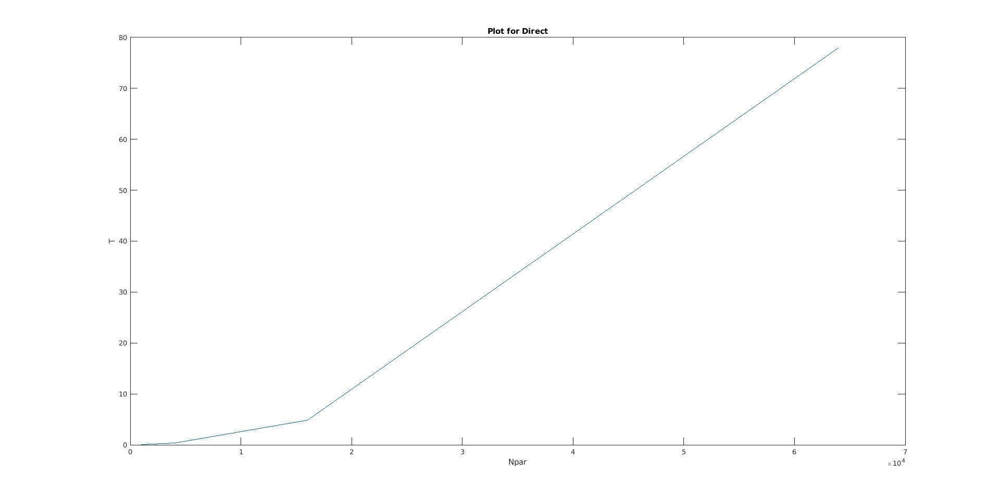

# CS653-HW1

## 1. Computational complexity

Output of running the _fmm2d.c_:

```console

L = 4
Npar = 1000 * 4^(0) = 1000
===== Max potential difference = 4.972490e-06 =====
===== Total FMM vs. direct energies & error = -1.101546e+05 -1.101546e+05 -2.055468e-08 =====
===== FMM & direct CPU times = 4.754000e-02 3.081600e-02 =====

L = 5
Npar = 1000 * 4^(1) = 4000
===== Max potential difference = 4.960206e-06 =====
===== Total FMM vs. direct energies & error = -1.101546e+05 -1.101546e+05 -2.738719e-08 =====
===== FMM & direct CPU times = 9.298200e-02 2.616900e-02 =====

L = 6
Npar = 1000 * 4^(2) = 16000
===== Max potential difference = 4.957777e-06 =====
===== Total FMM vs. direct energies & error = -1.101546e+05 -1.101546e+05 -2.603903e-08 =====
===== FMM & direct CPU times = 2.713620e-01 2.614500e-02 =====

L = 7
Npar = 1000 * 4^(3) = 64000
===== Max potential difference = 4.956997e-06 =====
===== Total FMM vs. direct energies & error = -1.101546e+05 -1.101546e+05 -2.695153e-08 =====
===== FMM & direct CPU times = 1.014456e+00 2.635400e-02 =====

```

### Plot for FMM


### Plot for Direct


### The fitting parametars values
|   |*FMM*|*Direct   |
|---|---|---|
|*p*| 0.9153 | 0.03798 |
|*C*| 4.037e-05 | -0.03664 |

### Fitted Plot for FMM


### Fitted Plot for Direct
