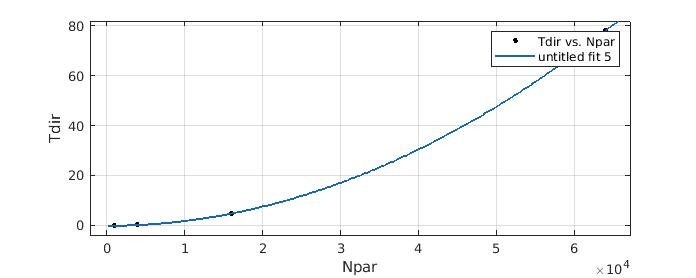

# CS653-HW1

## 1. Computational complexity

Output of running the _fmm2d.c_:

```console
L = 4
Npar = 1000 * 4^(0) = 1000
===== Max potential difference = 4.972490e-06 =====
===== Total FMM vs. direct energies & error = -1.101546e+05 -1.101546e+05 -2.055468e-08 =====
===== FMM & direct CPU times = 9.040000e-03 2.094400e-02 =====

L = 5
Npar = 1000 * 4^(1) = 4000
===== Max potential difference = 4.728141e-06 =====
===== Total FMM vs. direct energies & error = -1.661034e+06 -1.661034e+06 -8.392316e-09 =====
===== FMM & direct CPU times = 3.308400e-02 3.178300e-01 =====

L = 6
Npar = 1000 * 4^(2) = 16000
===== Max potential difference = 5.974920e-06 =====
===== Total FMM vs. direct energies & error = -2.572551e+07 -2.572551e+07 -4.764055e-09 =====
===== FMM & direct CPU times = 1.202010e-01 4.880406e+00 =====

L = 7
Npar = 1000 * 4^(3) = 64000 
===== Max potential difference = 5.733392e-06 =====
===== Total FMM vs. direct energies & error = -4.168857e+08 -4.168857e+08 -1.094234e-08 =====
===== FMM & direct CPU times = 4.922680e-01 7.803984e+01 =====
```

### Plots


### The Fitting Parametars Values
|   |FMM|Direct|
|---|---|---|
|**p**| 1.006 | 1.999 |
|**C**| 7.157e-06 | 1.92e-08 |

### Fitted Plots



### Output of MATLAB's Fitting Tool


#### Fit for FMM:
```console
General model:
     f(x) = c*power(x,p)
Coefficients (with 95% confidence bounds):
       c =   7.157e-06  (2.39e-06, 1.192e-05)
       p =       1.006  (0.9458, 1.067)

Goodness of fit:
  SSE: 1.368e-05
  R-square: 0.9999
  Adjusted R-square: 0.9999
  RMSE: 0.002616    
```

#### Fit for Direct:
```console
General model:
     f(x) = c*power(x,p)
Coefficients (with 95% confidence bounds):
       c =    1.92e-08  (1.8e-08, 2.04e-08)
       p =       1.999  (1.994, 2.005)

Goodness of fit:
  SSE: 0.0001603
  R-square: 1
  Adjusted R-square: 1
  RMSE: 0.008953
```

### Explanation

The conclusion from comparing *p* values of FMM and direct method, we see that FMM has linear complexity - O(N), whereas direct method has quadratic complexity - O(N^2).

##  2. Flop/s Performance

The modified source code is [here](src/fmm2d_mod.c).

Output is:
```console
L = 6
Npar = 1000 * 4^(2) = 16000
===== Gflop/s for FMM = 1.003135e+00 =====
===== Gflop/s for Direct = 1.013628e+00 =====
===== Max potential difference = 5.974920e-06 =====
===== Total FMM vs. direct energies & error = -2.572551e+07 -2.572551e+07 -4.764055e-09 =====
===== FMM & direct CPU times = 1.562660e-01 5.050880e+00 =====
```

The machine information:
```console
Architecture:        x86_64
CPU op-mode(s):      32-bit, 64-bit
Byte Order:          Little Endian
CPU(s):              12
On-line CPU(s) list: 0-11
Thread(s) per core:  2
Core(s) per socket:  6
Socket(s):           1
NUMA node(s):        1
Vendor ID:           GenuineIntel
CPU family:          6
Model:               158
Model name:          Intel(R) Core(TM) i7-8700 CPU @ 3.20GHz
Stepping:            10
CPU MHz:             800.044
CPU max MHz:         4600.0000
CPU min MHz:         800.0000
BogoMIPS:            6384.00
Virtualization:      VT-x
L1d cache:           32K
L1i cache:           32K
L2 cache:            256K
L3 cache:            12288K
NUMA node0 CPU(s):   0-11
Flags:               fpu vme de pse tsc msr pae mce cx8 apic sep mtrr pge mca cmov pat pse36 clflush dts acpi mmx fxsr sse sse2 ss ht tm pbe syscall nx pdpe1gb rdtscp lm constant_tsc art arch_perfmon pebs bts rep_good nopl xtopology nonstop_tsc cpuid aperfmperf tsc_known_freq pni pclmulqdq dtes64 monitor ds_cpl vmx smx est tm2 ssse3 sdbg fma cx16 xtpr pdcm pcid sse4_1 sse4_2 x2apic movbe popcnt tsc_deadline_timer aes xsave avx f16c rdrand lahf_lm abm 3dnowprefetch cpuid_fault epb invpcid_single pti ssbd ibrs ibpb stibp tpr_shadow vnmi flexpriority ept vpid ept_ad fsgsbase tsc_adjust bmi1 hle avx2 smep bmi2 erms invpcid rtm mpx rdseed adx smap clflushopt intel_pt xsaveopt xsavec xgetbv1 xsaves dtherm ida arat pln pts hwp hwp_notify hwp_act_window hwp_epp md_clear flush_l1d
```
